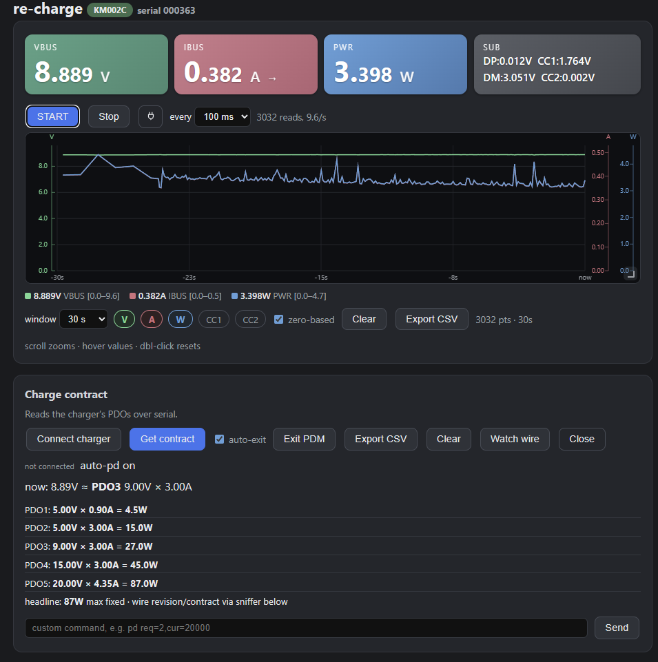

# re-charge — POWER-Z on browser

Talk to ChargerLab POWER-Z KM002C (`VID 0x5FC9 / PID 0x0061`) without the
Windows-only `Mtools.exe` from the manufacturer, directly in browser using WinUSB.

Needs Chrome/Chromium/Edge, sadly firefox doesn't support WebUSB.



## Layout

```
index.html            Single-file browser app: tiles, graph, contract, sniffer, debug
71-powerz.rules     Linux udev rule for 5FC9:0061/0063
docs/PROTOCOL.md      Byte maps, init sequence, R3.2 PDO layouts, quirks
docs/screenshot.png   Live view screenshot (shown above)
```

## Browser app (Chromium, single static file)

Live: https://jfessard.github.io/km003c-web/ — or open `index.html` directly (`file://`).

- **Live meters** — VBUS/IBUS/PWR tiles with current direction, up to 10×/s, or 1000SPS in proprietary mode.
- **Live graph** — V/A/W plus optional CC lines, hover values, zoom, CSV export, 1000 SPS streaming mode.
- **Active PDO contract** — show PDOs without disturbing charging (wire snoop at charger plug-in + VBUS matching).
- **Charge PDO contract** — read charger PDO table over serial (manual query, and restores the PDO)

## Not supported

- Offline logs stored on the device (no downloads yet, but the protocol has been documented).
- Firmware updates / DFU.
- Changing charger or dongle settings.
- Non-Chromium browsers (no WebUSB/Serial/HID in Firefox/Safari).

## Devices

- KM002C = `0x0061` Fully tested.
- KM003C = `0x0063` should work unmodified: all discovery filters are
  VID-only (`0x5FC9`), the 4-byte command protocol is shared across the
  family. Untested end-to-end; treat the SUB
  tile (CC2/D+/D-) as suspect on KM003C (ADC offsets moved across
  firmwares) — VBUS/IBUS are the safe core.

## Credits

- Protocol groundwork by [okhsunrog](https://github.com/okhsunrog):
  [`km003c-rs`](https://github.com/okhsunrog/km003c-rs) (auth keys, packet framing,
  AdcQueue) and [`km003c-protocol-research`](https://github.com/okhsunrog/km003c-protocol-research)
  (full RE'd protocol reference, special functions, PD analysis...)
- [`Pekaso/KM003C-Analyzer`](https://github.com/Pekaso/KM003C-Analyzer) — PD 3.2 decode tree (control/data/extended, SPR/EPR, PPS/AVS, RDO, VDM + JSON DP/TBT3 defs)
